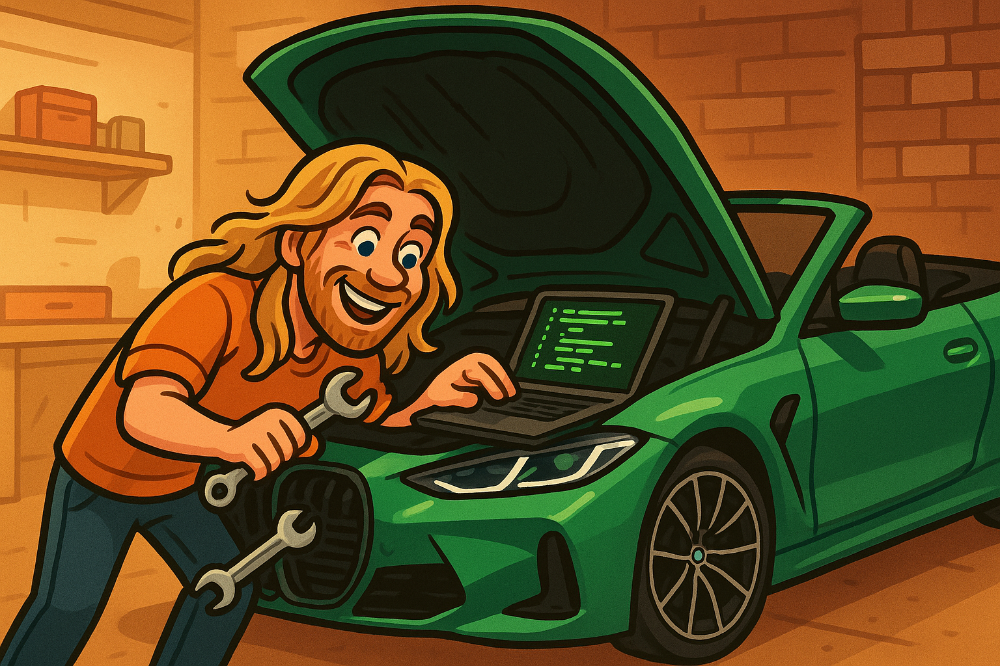

# Hey, I'm **Steve Ryherd** 👋

| About Me | &nbsp; |
|----------|--------|
| Automotive Sales Consultant at **[Airport Toyota](http://www.airtoy.com/) (Dayton, OH)**. Formerly: AlternateSolutions ➔ LexisNexis.  I automate the repetitive bits of the car-buying workflow and build browser toys after hours. |  |

---

## What I'm Building & Maintaining

| Project | One-liner |
| ------- | --------- |
| **[Neapolitan](https://github.com/SteveRyherd/neapolitan)** | Sexy browser extension that flips any site between production, staging, and dev with a click (or a keyboard shortcut). |
| **[steveryherd.com](https://steveryherd.com)** | My personal website for sales and consulting. |
| **BMW Image Tools** | Unofficial SDK for BMW's image generation API. |

---

## Connect

[🌐 Website](https://steveryherd.com) • [📘 Facebook](https://facebook.com/steve.ryherd) • [📸 Instagram](https://instagram.com/steveryherd) • [✉️ Email](mailto:steve@steveryherd.com) • [💼 LinkedIn](https://www.linkedin.com/in/steveryherd)

---

## Right Now

- Merging scattered repos into tidy monorepos.  
- Learning to deal with low-FODMAP snacks.   Missing flavor.
